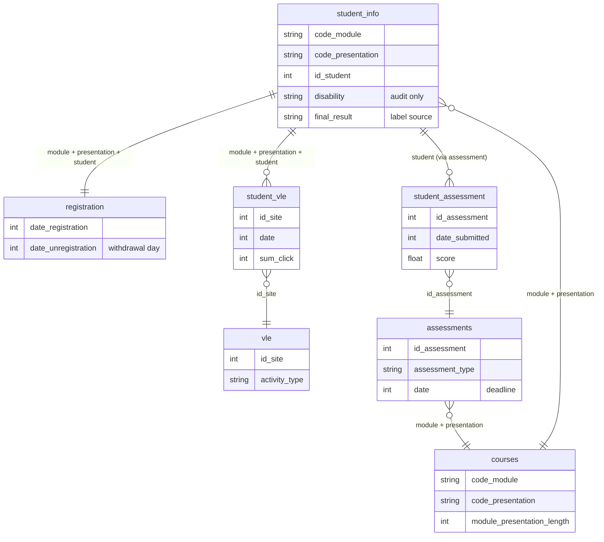

# OULAD Early Warning: an end-to-end MLOps pipeline

Flags learners at risk of failing or withdrawing four weeks into a course, retrains itself when
behaviour drifts, and audits every model for fairness toward learners who declared a disability.
Free, open-source tools throughout; AWS is used only for hosting.

## Why it matters

Learners who fail an online course usually go quiet weeks before a bad grade appears. Disabled
learners are more exposed to this, and a model that silently works worse for them hides the
problem. The disability flag is therefore **never a model input**. It is used only to audit recall.

## What it does

| Item | Definition |
| --- | --- |
| Unit | One student in one course presentation (module + term) |
| Prediction time | Day 28 (`CUTOFF_DAY`); features use events with `date < 28` only |
| Population | Students still enrolled at day 28 |
| Label | `at_risk` = final result is Fail or Withdrawn |
| Threshold | Tuned for 80% recall (missing a struggling learner costs more than an extra email) |
| Gate | A new model ships only if AUC >= champion **and** recall gap between disability groups <= 0.10 |

## Architecture

Model loop: Prefect pipeline -> MLflow registry (`champion` / `challenger` aliases) -> exported bundle
in `models/champion/` -> `model-promoted` event -> deploy workflow restarts the API.
Code loop: push to `main` -> CI (ruff, pytest) -> images tagged with the commit SHA on GHCR -> deploy.

## The data and how the tables connect

Seven OULAD tables (32,593 student enrolments, 10.6M daily click rows). A student in one course
presentation is identified by `code_module` + `code_presentation` + `id_student`.



## Tools used and why

| Layer | Tool | Why it is here |
| --- | --- | --- |
| Data | Parquet + DuckDB | The click log has 10.6M rows (447 MB as CSV, 29 MB as Parquet). DuckDB aggregates it with SQL straight from disk, so it never has to fit in pandas memory, and no Spark cluster is needed. |
| Features | pandas + SQL, cutoff at day 28 | Every feature uses only events before day 28, so the model cannot see the future (no target leakage). |
| Model | LightGBM, grouped split, early stopping | Fast and accurate on tabular data, handles missing values natively ("never submitted" is a signal), and retrains in seconds. Splitting by student stops the same learner appearing in train and validation. |
| Tracking / registry | MLflow 2.x | Records every run, metric and fairness audit, and keeps `champion` / `challenger` aliases so promotion and rollback are one call. |
| Fairness | Fairlearn (`MetricFrame`) | Education decisions affect people. It measures recall per disability group and enforces a gap of at most 0.10 as a deployment gate. |
| Drift | Own PSI + Evidently | Student behaviour changes between terms. PSI decides when to retrain; Evidently draws the readable report. |
| Orchestration | Prefect 3 | Plain-Python pipeline with retries and logs, one batch per run, no Airflow scheduler or database to run. |
| Serving | FastAPI + Uvicorn in Docker | Typed request validation, `/health` for Kubernetes probes, identical scores on any machine. |
| Cluster | kind locally, k3s on one EC2 instance; Kustomize | Same manifests locally and on AWS, with rolling updates and no downtime, without paying for EKS. |
| CI/CD | GitHub Actions, GHCR, OIDC + SSM | Tests and image builds on every push, and deploys with no stored AWS keys. |

## New tools explained

Short plain-language notes on each tool: what it is, and why it is used here.

| Tool | What it is | Why it is used here |
| --- | --- | --- |
| **Parquet** | A file format for storing tables by column, compressed and with real data types. | The raw click CSV is 447 MB; as Parquet the whole dataset is 29 MB, loads faster, and `?` becomes a proper null. |
| **DuckDB** | A Python package: point it at a file, ask a question in SQL, get the answer back. No server to run. | Sums 10.6M click rows into per-student features straight from disk, without loading them all into memory. |
| **LightGBM** | A library that builds many small decision trees, each correcting the last. | Accurate on table data, trains in seconds, and treats missing values as a signal. |
| **MLflow** | A tracker and catalogue for models: it stores every training run and its numbers. | Keeps model versions and the `champion` label, so promoting or rolling back a model is one call. |
| **Fairlearn** | A library that measures how a model performs for different groups. | Checks recall for disabled vs non-disabled learners, and blocks a model if the gap is over 0.10. |
| **PSI (Population Stability Index)** | A single number for how much a feature's distribution has shifted. Above 0.2 is a big shift. | Decides when student behaviour has changed enough to retrain the model. |
| **Evidently** | A library that draws HTML reports comparing new data to old. | Gives a readable drift report per batch; the retrain decision does not depend on it. |
| **Prefect** | A Python tool that runs steps in order, with retries and logs. | Runs one batch per run: score, check drift, retrain if needed, then apply the gates. |
| **FastAPI** | A Python framework for web APIs that validates requests automatically. | Serves `/predict` and `/health`, and generates interactive docs at `/docs`. |
| **Docker** | Packages code and its dependencies into an image that runs the same anywhere. | The API gave identical scores in the container and on my laptop. |
| **GHCR (GitHub Container Registry)** | GitHub's storage for Docker images, like a library for built images. | Free for public repos, and the cluster can pull images from it without extra credentials. |
| **Kubernetes** | A system that runs containers, keeps N copies alive, and replaces them safely. | Runs 2 API copies so a model update causes no downtime. |
| **kind** | Kubernetes running inside Docker on a laptop. | Lets me test the cluster locally for free. |
| **k3s** | A lightweight, certified Kubernetes that runs on one small server. | Runs the same manifests on one EC2 machine, avoiding the hourly fee of EKS. |
| **Kustomize** | Built into `kubectl`; patches shared YAML per environment. | One base config, with small local and AWS overlays. |
| **GitHub Actions** | GitHub's built-in automation that runs on every push. | Runs lint and tests, builds the images, and triggers deploys. |
| **OIDC** | A way for GitHub to prove its identity to AWS with a short-lived token. | No AWS keys are stored in the repo, so there is nothing to leak. |
| **SSM (AWS Systems Manager)** | AWS's way to run commands on a server without SSH. | The deploy workflow restarts the API on the instance without opening port 22. |
| **S3** | AWS's file storage. | Holds data, models and reports so they survive if the instance is deleted. |

## Results (produced by this repo, local run)

Training: 2013B + 2013J, 11,809 enrolled-at-day-28 rows, at-risk rate 0.444.

| Metric | Validation (champion v1) |
| --- | --- |
| ROC AUC | 0.785 |
| PR AUC | 0.769 |
| Recall at threshold (0.332) | 0.800 |
| Precision | 0.598 |
| Recall, disability = Y (n = 246) | 0.843 |
| Recall, disability = N (n = 2117) | 0.795 |
| Recall gap | 0.048 |

Replaying the 13 presentations of 2014 as a stream (drift injected at batch 5):

| Outcome | Batches |
| --- | --- |
| Retrain triggered | 13 of 13 (drift share was 0.38 to 0.89 on every batch) |
| Challenger promoted | 7 |
| Challenger did not beat the champion | 4 |
| **Blocked by the fairness gate despite higher AUC** | 2 (`05_GGG_2014B`, `10_EEE_2014J`) |
| Champion mean AUC / recall / recall gap on the stream | 0.752 / 0.771 / 0.048 |

### Experiments: cutoff day and demographics

Validation on 2013 (logged in MLflow, not registered). Waiting longer buys accuracy, and adding
demographics gives a small AUC gain but does not consistently narrow the disability recall gap.

| Cutoff day | Demographics | ROC AUC | Recall gap |
| --- | --- | --- | --- |
| 14 | off | 0.730 | 0.040 |
| 14 | on | 0.752 | 0.031 |
| 28 | off | 0.785 | 0.048 |
| 28 | on | 0.798 | 0.057 |
| 42 | off | 0.812 | 0.028 |
| 42 | on | 0.819 | 0.046 |

### AWS replay

The same 13-batch replay ran on the k3s instance: 13 of 13 retrains triggered, 5 promotions
(champion v1 to v11), and 2 challengers blocked by the fairness gate (`05_GGG_2014B`, `10_EEE_2014J`).
Results differ slightly from the local run because model training is not identical across machines.

Caveats: the drift monitor fires on every batch because each batch is a single module while the
reference mixes several (`code_module` itself is excluded from the drift share, other features still
differ by module). A per-module reference (Phase 5.5, fix 2) would be the next improvement. Small
groups make per-batch recall gaps noisy; always read them next to group sizes.
Docker check: the container returns scores identical to the local run; image size 747 MB.

## Run it locally

```bash
python3.12 -m venv .venv && source .venv/bin/activate     # 3.11 or newer
pip install -r requirements.txt -r requirements-dev.txt && pip install -e .
# put the seven OULAD CSVs in data/raw/, then:
make data                                                 # CSV -> Parquet bronze
make mlflow                                               # terminal 2, UI at http://127.0.0.1:5001
make bootstrap                                            # train, audit, register champion v1
INJECT_DRIFT_AT=5 bash -c 'for i in $(seq 13); do python -m pipelines.flow; done'
jq '.history[] | {batch, drift_share, champion_auc, promoted}' data/state/stream_state.json
make api                                                  # http://localhost:8000/docs
make kind-up && make kind-deploy                          # needs kind
```

Notes: LightGBM on macOS needs `brew install libomp`. MLflow runs on port **5001** because macOS
AirPlay Receiver occupies 5000. `sqlalchemy<2.1` is pinned because MLflow 2.x does not import with 2.1.

## Deploy to AWS

Follow Phase 9 of the build guide: S3 bucket, instance role, security group, EC2 `t3.medium` with k3s,
GitHub OIDC role, `kubectl apply -k k8s/overlays/aws` (replace `__OWNER__` and `__BUCKET__` first).
Set the secrets `AWS_DEPLOY_ROLE_ARN`, `AWS_REGION`, `EC2_INSTANCE_ID`. Tear down before credits end.

## Design decisions

- **Cutoff and population**: students who already withdrew are excluded; predicting them is pointless and inflates accuracy.
- **Fairness as a gate**: enforced in code (`passes_fairness`), not a slide.
- **One preprocessing function** (`prepare_frame`) for training and serving, to prevent skew.
- **Bundle, not pyfunc**: the API loads `model.txt` + `metadata.json` and never imports MLflow.
- **k3s instead of EKS**: same Kubernetes API without the control-plane fee.

## Limitations and ethics

Adult distance learners, not children. The disability flag is a coarse self-declared Y/N. Data is from
2013-2014, so exact coefficients would not transfer. The stream is simulated: real labels arrive weeks
later, here they are read immediately. Clicks measure activity, not understanding. This model supports
outreach decisions by people; it must never be used to penalise a learner.

## Dataset

Kuzilek, Hlosta and Zdrahal, "Open University Learning Analytics dataset", *Scientific Data*, 2017.
Licence: CC BY 4.0.
